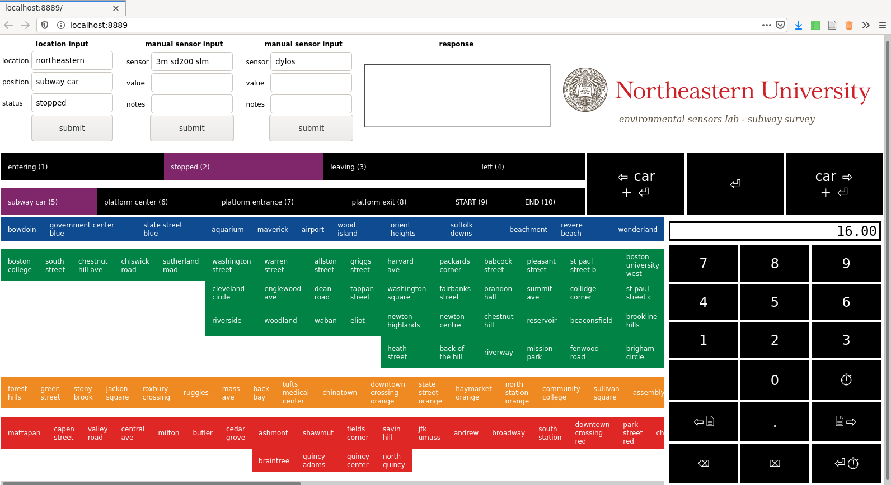

# MBTA Subway Conditions Survey 2018-2019 surveying and analysis tools

To view the website source code, see the [gh-pages branch of this repository](https://github.com/envsensorslab/subway-survey/tree/gh-pages). To view the website itself, click here: [envsensorslab.github.io/subway-survey/](envsensorslab.github.io/subway-survey/)

This repository contains tools for collecting and analyzing subway survey data. The following components are included:

* Drivers for transferring data between certain sensors and a computer;
* An annotation tool for live recording of train position and status, including fields for recording manual observations and a number pad for recording numeric data manually; and
* A tool for aligning annotations produced by the annotation tool with collected vibration data, to produce more accurate annotations than could be produced during surveying.

### Live annotation tool

### Annotation alignment tool

More documentation to follow
