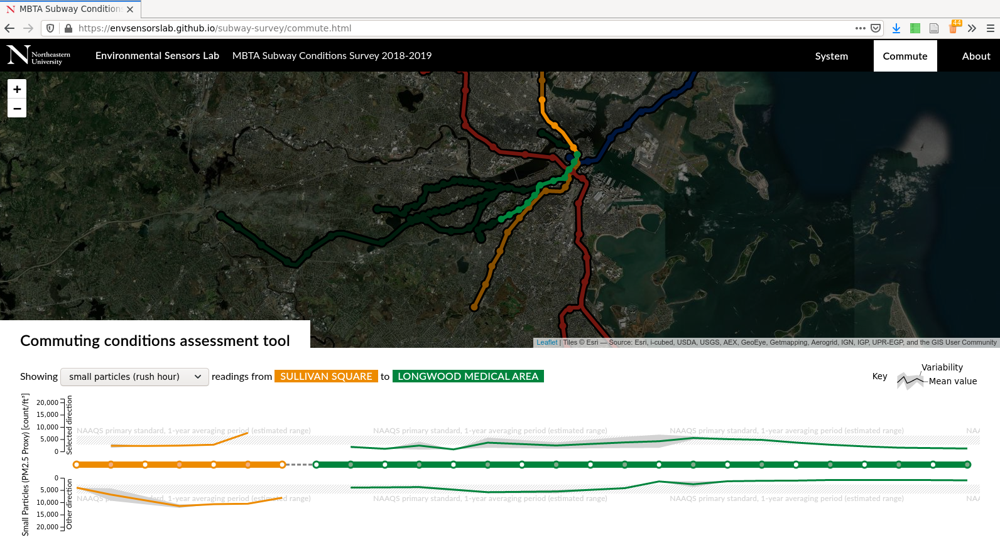

# MBTA Subway Conditions Survey 2018-2019 website

To view the analysis source code, see the [master branch of this repository](https://github.com/envsensorslab/subway-survey/tree/master). To view the website itself, click here: [envsensorslab.github.io/subway-survey/](https://envsensorslab.github.io/subway-survey/)

The MBTA Subway Conditions Survey 2018-2019 was a project to quantify the environmental conditions withhin the Boston subway system, as experienced by people who ride it. This repository contains the source code for the website that people can use to view the collected data.

### System conditions assessment tool

### Commute conditions assessment tool

More documentation to follow
